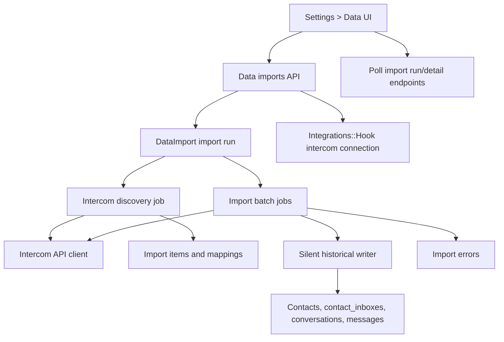

# Intercom Import PRD and TDD

Last researched: 2026-07-02

## Summary

Build a Settings > Data import experience that lets account administrators import contacts and conversations from Intercom into Chatwoot. The first production release should prioritize the Intercom integration path, while leaving the product and technical model open for CSV/file imports, exports, and other providers later.

The critical engineering requirement is that historical import must be silent. Importing records must not contact end customers, must not notify agents, and must not trigger automations, webhooks, campaigns, CSAT, Captain, or live conversation broadcasts. The current Chatwoot message and conversation creation paths are not safe for this because they enqueue outbound delivery and dispatch product events.

## Current MVP Slice

This implementation ships the recommended first slice:

- Add Intercom as an account integration card and connection settings page.
- Validate and store a private Intercom access token through `Integrations::Hook`.
- Add Settings > Data with Import and Export tabs, where Export is intentionally empty for now.
- Start Intercom imports for contacts and conversations without file upload, preview, or a multi-step wizard.
- Auto-create or reuse placeholder `Channel::Api` inboxes from inferred Intercom `source.type` buckets, for example `Intercom Import - Email` and `Intercom Import - Messenger`.
- Import historical contacts, conversations, and text message parts through a silent writer that avoids normal outbound message delivery and realtime/event side effects.

Users can rename the placeholder inboxes or configure real authenticated inboxes later. File upload, import detail pages, richer preflight previews, attachment binary import, custom field mapping, and export logic remain future phases in this document.

## Research Sources

- [Intercom help: import user data](https://www.intercom.com/help/en/articles/177-import-your-user-data-into-intercom): Intercom supports CSV and REST API imports, exposes imports under Settings > Data > Imports & exports, documents identifier precedence, and warns that newly imported users can immediately match live message rules.
- [Intercom API: list contacts](https://developers.intercom.com/docs/references/rest-api/api.intercom.io/contacts/listcontacts), [search contacts](https://developers.intercom.com/docs/references/rest-api/api.intercom.io/contacts/searchcontacts), [list conversations](https://developers.intercom.com/docs/references/rest-api/api.intercom.io/conversations/listconversations), and [retrieve conversation](https://developers.intercom.com/docs/references/rest-api/api.intercom.io/conversations/retrieveconversation): use these as the canonical Intercom source APIs for discovery and import.
- [Intercom OpenAPI 2.15](https://raw.githubusercontent.com/intercom/Intercom-OpenAPI/main/descriptions/2.15/api.intercom.io.yaml): conversation payloads expose channel-like `source.type` values and assignment/team fields, but not a durable Chatwoot-style inbox identifier.
- [Freshdesk import/export help](https://support.freshdesk.com/support/solutions/articles/196491-importing-and-exporting-customer-data): useful product benchmark for CSV mapping, required identifiers, import history, and validation guidance.
- [Community Intercom to Chatwoot script](https://github.com/curtishall/intercom_to_chatwoot): confirms practical needs around conversation/message import, duplicate handling, 429 retries, and warns that normal Chatwoot API-based imports can email contacts and agents.

## Repository Findings

- `DataImport` currently means "contact CSV import". It only accepts `data_type: contacts`, attaches an import file, and automatically enqueues `DataImportJob` after create.
- `DataImportJob` parses CSV contacts, bulk imports contacts, writes failed records, and sends administrator notification emails on completion or failure. This path should stay working for the current contacts page import, but it is not the right execution path for silent Intercom imports.
- `DataImport::ContactManager` may save existing contacts while building an import row. That can dispatch contact update events and must not be reused blindly for silent integration imports.
- `Message` creation is unsafe for historical import. `after_create_commit` runs `send_reply`, dispatches `MESSAGE_CREATED`, may dispatch `FIRST_REPLY_CREATED`, updates conversation activity, and can reopen conversations. `SendReplyJob` then routes to channel-specific outbound services, including Email, API, WebWidget, WhatsApp, Instagram, SMS, and others.
- `Conversation` creation and updates dispatch conversation events. The sync dispatcher includes ActionCable and agent bot listeners. The async dispatcher includes automation, campaign, CSAT, hooks, installation webhooks, notifications, unread counts, reporting events, and webhooks. Enterprise adds `CaptainListener`.
- `Integrations::Hook` is the existing account integration connection model. It has an `access_token` column, encrypted when Chatwoot encryption is configured, and `config/integration/apps.yml` supports hidden settings through `visible_properties`.
- Sidekiq queues currently include `low` but no import-specific queue. Existing `DataImportJob` uses `low`; `SendReplyJob` uses `high`.
- Settings routes are modular under `app/javascript/dashboard/routes/dashboard/settings/settings.routes.js`, so a new `settings/data` route group should fit the existing frontend structure.
- Intercom does not expose a clean equivalent of a Chatwoot inbox on the conversation. The closest signals are source channel, team assignment, admin assignment, tags, and custom attributes. These are routing hints, not proof that a conversation belongs in a specific Chatwoot inbox.

## Domain Model

- Data import: A user-visible import run owned by an account.
- Import source: Where data comes from, for example `integration/intercom` or `file/csv`.
- Import connector: Provider-specific reader and mapper. Intercom is the first connector.
- Import target: The Chatwoot inbox and object types selected by the admin.
- Import item: A source object processed within a run, such as a source contact or conversation.
- Import mapping: Durable source object to Chatwoot object mapping used for idempotency and resume.
- Preflight: Credential validation plus source sampling before import starts.
- Silent historical ingestion: A write path that stores historical records without normal realtime, automation, webhook, notification, reporting, or outbound-delivery side effects.
- Abandoned import: A user-stopped or system-stopped run that preserves imported records and progress but no longer schedules work.

Preferred ubiquitous language: use "import run" in UI and API payloads; use "batch job" only for background processing internals.

## Product Requirements

### Goals

- Add Settings > Data with two tabs: Import and Export.
- Keep Export as an empty or coming-soon tab for the first release.
- Let admins connect Intercom, validate credentials, preview discovered data, choose import scope, review proposed source-bucket inboxes or a fallback inbox, map fields where needed, and start import.
- Show active and previous imports with progress, counts, timestamps, duration, status, initiating user, and source.
- Show an import detail page with counts, source details, selected config, progress, ETA, errors, and sample created records.
- Import contacts, conversations, and conversation messages from Intercom while preserving historical timestamps when possible.
- Continue processing after per-record failures and make errors downloadable or inspectable.
- Support resumable, idempotent processing across Sidekiq retries and process restarts.
- Guarantee no end-customer communication and no agent notifications.

### Non-goals for the first Intercom release

- Full bidirectional sync with Intercom.
- Intercom company import.
- Intercom article/help-center import.
- Automatic perfect mapping to every Chatwoot channel type.
- Sending any imported messages through connected channel providers.
- Replaying historical events into Chatwoot reports, automations, campaigns, webhooks, or notifications.
- Importing every attachment binary in the first pass. The MVP can store attachment metadata and record skipped attachment counts unless product explicitly expands scope.
- Rebuilding the existing contacts CSV import UI in this first slice, beyond keeping it compatible.

## UX Requirements

### Settings > Data

Add a Settings sidebar item named Data. It opens a page with tabs:

- Import
- Export

The Export tab can show an empty state or disabled "Coming soon" surface. Do not build export logic as part of the Intercom MVP.

### Import List

The Import tab shows a table of import runs:

- Name
- Source: Intercom, CSV file, or future providers
- Source type: Integration or File
- Import type: Contacts, Conversations, or Both
- Created at
- Initiating user
- Status: Pending, Validating, Ready, In progress, Completed, Completed with errors, Failed, Abandoned
- Imported count
- Total discovered count or estimated total
- Started at
- Completed at
- Duration

The table should poll while any import is active. It should not rely on conversation/message ActionCable events for import progress.

Primary action: New import.

### Import Detail

The detail page for an import run shows:

- Source provider and connection metadata, excluding secrets.
- Source file download when the source is file-based.
- Import type selection, source-bucket inbox routing, and fallback inbox.
- Status, progress, ETA, duration, started at, completed at, and initiated by.
- Counts discovered, processed, imported, skipped, failed, and updated per object type.
- Errors grouped by type with source ID, item type, error code, message, attempt count, and timestamp.
- Samples of created or matched contacts and conversations with links to Chatwoot records.
- Selected mapping/configuration.
- Abandon action for active imports.

### New Import Wizard

Steps:

1. Source
   - Choose File or Integration.
   - File import can show CSV as future/disabled if not implemented in the first Intercom slice.
   - Integration shows Intercom.

2. Connect Intercom
   - If no active Intercom connection exists, ask for an Intercom access token.
   - Validate the token against Intercom before storing/enabling the connection.
   - Store only safe connection metadata in settings. Never echo the token.

3. Scope and Target
   - Choose Contacts, Conversations, or Both.
   - Let the admin choose whether to auto-create source-bucket import inboxes or use one fallback target inbox.
   - Recommended MVP default is auto-create/reuse placeholder Chatwoot API inboxes based on inferred Intercom source buckets, for example `Intercom Import - Email`, `Intercom Import - Instagram`, and `Intercom Import - Unknown`.
   - These placeholder inboxes are for imported history organization. They are not real authenticated Email, WhatsApp, Instagram, SMS, or Messenger inboxes.
   - Optional advanced routing can be added as an explicit mapping step, but only when the admin maps Intercom signals such as source channel or team to Chatwoot inboxes.

4. Preview and Mapping
   - Fetch sample Intercom contacts and conversations.
   - Show proposed mappings for contact fields and conversation/message metadata.
   - Allow admins to map extra Intercom attributes into Chatwoot custom attributes or additional attributes.
   - Semantic/LLM-assisted mapping can be a later enhancement; first release should ship deterministic mappings with user override.

5. Review and Start
   - Summarize scope, proposed source-bucket inboxes or fallback inbox, counts or estimates, skipped known unsupported data, and the silent-import guarantee.
   - Start background processing and navigate to detail/progress.

## Intercom Import Mapping

### Contacts

Identity precedence should be deterministic and visible:

1. Existing durable mapping for Intercom contact ID.
2. Chatwoot contact `identifier` from Intercom external ID or user ID when present.
3. Email.
4. Phone number.
5. Create a new contact with Intercom ID stored in metadata when no stronger identity exists.

Store Intercom metadata under a namespaced key, for example:

```json
{
  "source": {
    "provider": "intercom",
    "contact_id": "intercom_contact_id",
    "external_id": "external_or_user_id"
  }
}
```

Do not overwrite existing Chatwoot contact fields with blanks. For conflicting existing contacts, prefer non-destructive merge and record a warning on the import item.

### Contact Inboxes

Create or reuse a `ContactInbox` for the resolved source-bucket or fallback inbox and imported contact. The `source_id` must be deterministic and unique for idempotency, for example `intercom:<contact_id>` after confirming it satisfies the selected channel constraints.

For the MVP, strongly prefer API inbox targets because channel-specific inboxes such as WhatsApp, Twilio, and others have source ID format constraints and outbound provider behavior that should be handled only with explicit channel mapping.

### Inbox Routing

Intercom should not be treated as if every conversation has a native Chatwoot inbox. In Chatwoot, an inbox is usually a concrete channel instance. In Intercom, the API exposes channel-like source metadata and routing/ownership metadata, but those concepts do not reliably identify the destination Chatwoot inbox.

Available Intercom routing hints:

- `source.type`: channel-like origin such as conversation, email, facebook, instagram, sms, twitter, or whatsapp.
- `source.delivered_as`: initiation type such as customer, campaign, operator, automated, or admin initiated.
- `team_assignee_id`: Intercom team currently assigned to the conversation.
- `admin_assignee_id`: Intercom teammate currently assigned to the conversation.
- Conversation tags, custom attributes, URL, and app/package metadata when present.
- Conversation part assignment events, which can show how ownership changed over time but are not a stable inbox identity.

MVP routing rule:

1. Infer a normalized source bucket from Intercom `source.type`.
2. Auto-create or reuse a placeholder `Channel::Api` inbox per bucket.
3. Import each conversation into the matching placeholder API inbox.
4. Store all Intercom routing hints on the conversation import metadata.
5. Mark the import detail with a routing method of `source_bucket_api_inbox`.
6. Do not create empty real WhatsApp, Instagram, Email, SMS, or Messenger channel inboxes only because `source.type` looks similar.

Suggested bucket mapping:

- `email` -> `Intercom Import - Email`
- `instagram` -> `Intercom Import - Instagram`
- `facebook` -> `Intercom Import - Facebook`
- `sms` -> `Intercom Import - SMS`
- `twitter` -> `Intercom Import - Twitter`
- `whatsapp` -> `Intercom Import - WhatsApp`
- `phone_call` -> `Intercom Import - Phone`
- `conversation`, `push`, or web/app messenger style sources -> `Intercom Import - Messenger`
- unknown or missing source -> `Intercom Import - Unknown`

Placeholder inbox creation:

- Use `Channel::Api`, because it can be created without external credentials and accepts deterministic import `ContactInbox.source_id` values.
- Name the inbox from the normalized source bucket.
- Store metadata on `Channel::Api.additional_attributes`, for example `source_provider: intercom`, `source_bucket: email`, and `import_placeholder: true`.
- Set a narrow positive `agent_reply_time_window` where appropriate so old imported conversations are not readily replyable from placeholder API inboxes.
- Import conversations as historical/resolved by default unless product explicitly chooses to preserve open state.

Important limitation: a placeholder API inbox cannot simply become a real authenticated WhatsApp, Instagram, SMS, or Email inbox later. The inbox is tied to a concrete channel type at creation. Users can rename placeholder inboxes, adjust membership/assignment, and use them for historical organization. Connecting real channel authentication later should create or use a real channel inbox, with a separate future migration or remapping flow if conversations need to move.

Optional advanced routing:

1. During discovery, fetch Intercom teams through the Teams API and sample conversation `source.type` values.
2. Show an admin-configurable mapping table:
   - Intercom source type to source-bucket API inbox or existing Chatwoot inbox.
   - Intercom team to Chatwoot inbox or Chatwoot team.
   - Fallback default inbox for unmatched conversations.
3. Apply mappings only when the selected Chatwoot inbox can accept the generated `ContactInbox.source_id` safely.
4. Store the chosen routing rule on each import item and conversation metadata.
5. If multiple rules match or no rule matches, use the fallback inbox and record a warning instead of guessing.

Recommended first release behavior: create/reuse source-bucket placeholder API inboxes and import conversations there as historical records. This preserves useful grouping without claiming future replies will continue through the original Intercom channel.

### Conversations

Create or reuse a conversation by durable Intercom conversation mapping. Preserve:

- Source conversation ID.
- Source URL if available.
- Intercom state/status where useful.
- Created at, updated at, and last activity timestamps where available.
- Target inbox and contact inbox selected by the import config.

Imported conversations should not be assigned to agents automatically unless a future mapping screen explicitly maps Intercom admins to Chatwoot users. Store Intercom assignee/admin metadata in additional attributes for traceability.

### Messages

Map Intercom conversation source and parts into Chatwoot messages:

- Customer/user/lead-authored parts become incoming messages.
- Admin-authored parts become outgoing messages, with sender metadata preserved. If no Chatwoot user mapping exists, avoid impersonating a random user; store the Intercom author in message metadata.
- Intercom notes become private messages.
- Empty bot/Fin/system parts can be skipped with a skipped count and reason.
- Preserve historical `created_at` timestamps.
- Preserve external source ID on `messages.source_id` and/or `messages.external_source_ids`.
- Store unsupported attachment metadata and skip reasons if attachment binary import is out of MVP scope.

The import writer must explicitly populate fields normally handled by callbacks, such as processed content and conversation activity, because the normal ActiveRecord create path should be bypassed.

## Technical Design

### High-Level Architecture



### Data Model

Extend `data_imports` into the generic import-run record while preserving current CSV contact import behavior.

Recommended new or changed fields:

- `name`
- `source_type`: `file`, `integration`
- `source_provider`: `csv`, `intercom`
- `import_types`: jsonb array, for example `["contacts", "conversations"]`
- `initiated_by_id`: user who started it
- `integration_hook_id`: optional FK to `integrations_hooks`
- `target_inbox_id`: optional FK to a fallback inbox when source-bucket inbox creation is disabled or a source cannot be resolved
- `status`: keep existing integer enum compatibility and append statuses
- `config`: jsonb selected mapping/configuration
- `source_metadata`: jsonb safe provider metadata
- `stats`: jsonb counts by type and status
- `cursor`: jsonb provider pagination/checkpoint state
- `routing_rules`: jsonb selected source bucket/team/default inbox routing rules, or store under `config.routing_rules`
- `started_at`
- `completed_at`
- `abandoned_at`
- `last_error_at`

Keep `processed_records`, `total_records`, `processing_errors`, `import_file`, and `failed_records` compatible with the legacy contact CSV flow until that flow is migrated.

Add `data_import_items`:

- `data_import_id`
- `source_provider`
- `source_object_type`: contact, conversation, message, attachment
- `source_object_id`
- `status`: pending, processing, imported, skipped, failed
- `chatwoot_record_type`
- `chatwoot_record_id`
- `attempt_count`
- `last_error_code`
- `last_error_message`
- `metadata` jsonb
- timestamps
- unique index on `data_import_id, source_object_type, source_object_id`

Add `data_import_mappings`:

- `account_id`
- `source_provider`
- `source_object_type`
- `source_object_id`
- `chatwoot_record_type`
- `chatwoot_record_id`
- `data_import_id`
- `metadata` jsonb
- timestamps
- unique index on `account_id, source_provider, source_object_type, source_object_id`

Add `data_import_errors` if item-level error fields are not enough for the UI:

- `data_import_id`
- `data_import_item_id`
- `source_object_type`
- `source_object_id`
- `error_code`
- `message`
- `details` jsonb
- timestamps

### Compatibility With Existing DataImportJob

Change automatic enqueue behavior so only the existing legacy contacts CSV import auto-enqueues `DataImportJob`. New integration imports should be created in a draft/ready state and started only by an explicit start endpoint.

This avoids creating a new Intercom import run that immediately tries to parse a nonexistent CSV attachment.

### Intercom Connection

Add an Intercom entry to `config/integration/apps.yml` using `Integrations::Hook`:

- `app_id: intercom`
- `hook_type: account`
- `allow_multiple_hooks: false`
- `visible_properties`: only safe metadata such as workspace name/id and last validated timestamp

Store the Intercom token in `integrations_hooks.access_token`, not in `settings`. Add an Intercom-specific validator path similar in spirit to the existing OpenAI/Dyte validators, but avoid hardcoding more provider branches if a small app-level validation hook is introduced.

The validator should:

- Send a lightweight authenticated request to Intercom.
- Verify contact/conversation read scope enough for discovery.
- Store safe workspace metadata when available.
- Return clear validation errors for invalid token, missing scope, rate limit, and provider outage.

### Intercom Client

Add a small client under `app/services/data_imports/sources/intercom/` or `lib/integrations/intercom/` with:

- Bearer token auth.
- Explicit Intercom API version header based on the currently supported docs.
- Paginated contacts and conversations readers.
- Conversation retrieval that includes parts/messages.
- 429 handling using `Retry-After` when present.
- Bounded retries for transient 5xx/network errors.
- No provider writes.

Do not hide provider errors in the client. Return typed errors so import jobs can record failed items and continue where appropriate.

### Silent Historical Writer

Do not use `Messages::MessageBuilder`, `ConversationBuilder`, or normal `Message.create!` for imported historical messages.

Preferred approach:

- Use dedicated writer services, for example `DataImports::Writers::HistoricalContactWriter`, `HistoricalConversationWriter`, and `HistoricalMessageWriter`.
- Use `insert_all`, `upsert_all`, or `activerecord-import` for import rows to avoid create/update callbacks that trigger dispatchers and `SendReplyJob`.
- Use transactions at conversation or small batch boundaries.
- Explicitly maintain fields normally updated by callbacks, including conversation `last_activity_at`, message processed content, and mappings.
- Use mapping tables for idempotency before creating records.
- Reindex search only through an explicit, low-priority follow-up path if required.

If a callback-suppression context is introduced, it must be defense in depth, not the only guard. The test suite should prove imported messages do not enqueue outbound jobs or dispatch events.

### Background Processing

Jobs:

- `DataImports::Intercom::DiscoveryJob`: validates connection, fetches samples, initializes counts/estimates, and stores preview metadata.
- `DataImports::Intercom::PlanJob`: creates import items for discovered source IDs when the provider supports efficient listing.
- `DataImports::Intercom::ProcessBatchJob`: processes a bounded page or item batch, writes records, records errors, updates stats, and enqueues the next batch if the run is still active.
- `DataImports::AbandonJob` or service: marks a run abandoned and prevents further scheduling.

Use the `low` queue initially, or add a dedicated `imports` queue only if ops wants separate concurrency. Batches should be small enough that Sidekiq timeout and deployment restarts do not lose meaningful progress.

Progress and ETA:

- Use `stats`, item counts, and moving average throughput.
- Treat Intercom totals as estimates unless the API response gives an exact total.
- Show "discovering" when totals are unknown.

Resume:

- Jobs must read the latest import run status before work.
- Each source object must be idempotent by mapping key.
- Cursor and item status updates must happen after each page/batch.
- Per-record failures should mark the item failed/skipped, store an error, and continue.

### API Design

Suggested account-scoped endpoints:

- `GET /api/v1/accounts/:account_id/data_imports`
- `POST /api/v1/accounts/:account_id/data_imports`
- `GET /api/v1/accounts/:account_id/data_imports/:id`
- `POST /api/v1/accounts/:account_id/data_imports/:id/validate`
- `POST /api/v1/accounts/:account_id/data_imports/:id/start`
- `POST /api/v1/accounts/:account_id/data_imports/:id/abandon`
- `GET /api/v1/accounts/:account_id/data_imports/:id/items`
- `GET /api/v1/accounts/:account_id/data_imports/:id/errors`

Intercom connection can either reuse integration hook endpoints or add a focused endpoint:

- `POST /api/v1/accounts/:account_id/integrations/intercom/validate`
- `POST /api/v1/accounts/:account_id/integrations/intercom`

Only account administrators should create, validate, start, or abandon imports.

### Frontend Design

Likely files:

- `app/javascript/dashboard/routes/dashboard/settings/data/data.routes.js`
- `app/javascript/dashboard/routes/dashboard/settings/data/Index.vue`
- `app/javascript/dashboard/routes/dashboard/settings/data/ImportList.vue`
- `app/javascript/dashboard/routes/dashboard/settings/data/ImportDetails.vue`
- `app/javascript/dashboard/routes/dashboard/settings/data/NewImportWizard.vue`
- `app/javascript/dashboard/api/dataImports.js`
- `app/javascript/dashboard/store/modules/dataImports.js` or a Pinia store if that area has moved.
- `app/javascript/dashboard/i18n/locale/en/*.json` only for new strings.

Follow current Settings layout patterns and Composition API with `<script setup>` for new Vue components.

## Side-Effect Guardrails

The import path is only acceptable if tests prove:

- No `SendReplyJob` is enqueued.
- No channel-specific send service is called.
- No `ActionCableBroadcastJob` is enqueued.
- No `EventDispatcherJob` is enqueued for imported contacts, conversations, or messages.
- No `Notification` rows are created.
- No notification email or push jobs are enqueued.
- No account webhook or API inbox webhook jobs are enqueued.
- No automation rule, campaign, CSAT, Slack/hook, reporting, unread-count, or Captain listener work is triggered.
- Existing legacy contact CSV import behavior and admin emails remain unchanged unless product explicitly changes them.

## Security and Privacy

- Do not return Intercom tokens in API responses.
- Store Intercom access tokens in `integrations_hooks.access_token`; use encryption when configured.
- Avoid storing raw Intercom payloads wholesale. Store only source IDs, safe metadata, and error details needed for debugging.
- Redact emails, phone numbers, and message content from logs.
- Restrict import management to administrators.
- Consider audit logging for connection creation, import start, abandon, and completion.

## Enterprise Compatibility

Before implementation, search OSS and Enterprise trees for each touched controller, model, listener, and policy. The import writer must be compatible with Enterprise dispatch extensions, especially `CaptainListener`, by avoiding event dispatch for historical imports.

If policy or Settings navigation has Enterprise overlays, mirror or extend through existing Enterprise mechanisms rather than hardcoding OSS-only behavior.

## Testing Strategy

Backend:

- Model specs for new `DataImport`, item, mapping, and error validations/index behavior.
- Request specs for list, detail, validate, start, abandon, and authorization.
- Intercom client specs with stubbed pagination, unauthorized, missing scope, 429, 5xx, and malformed payload responses.
- Discovery/job specs for cursor persistence, retry behavior, stats, ETA inputs, and skip-forward errors.
- Writer specs for contact merge/idempotency, contact inbox source IDs, conversation/message timestamps, private notes, skipped empty parts, and durable mappings.
- Regression specs asserting no outbound jobs, notifications, webhooks, dispatch jobs, or ActionCable broadcasts are produced by historical import.
- Legacy specs proving current `DataImportJob` contacts CSV behavior still works.

Frontend:

- API module tests.
- Store/composable tests for polling and wizard state.
- Component tests for import list, detail, wizard validation, inactive/active connection states, and error rendering.
- Route permission tests for Settings > Data.

Suggested validation commands after implementation:

```sh
eval "$(rbenv init -)" && bundle exec rspec spec/models/data_import_spec.rb spec/jobs/data_import_job_spec.rb
eval "$(rbenv init -)" && bundle exec rspec spec/services/data_imports spec/requests/api/v1/accounts/data_imports_controller_spec.rb
eval "$(rbenv init -)" && bundle exec rubocop app/models/data_import.rb app/jobs/data_imports app/services/data_imports app/controllers/api/v1/accounts/data_imports_controller.rb spec/services/data_imports spec/requests/api/v1/accounts/data_imports_controller_spec.rb
pnpm exec vitest app/javascript/dashboard/routes/dashboard/settings/data app/javascript/dashboard/api/specs/dataImports.spec.js
pnpm eslint app/javascript/dashboard/routes/dashboard/settings/data app/javascript/dashboard/api/dataImports.js
```

## Implementation Plan

### Phase 1: Domain and API Foundation

1. Extend import-run schema and model
   - Size: M
   - Dependencies: none
   - Work: Expand `DataImport` into a generic import run, add import statuses, source metadata, selected config, fallback inbox, initiating user, hook relation, timestamps, and stats while preserving legacy contact CSV imports.
   - Acceptance: Existing `DataImportJob` specs pass; new Intercom import runs do not auto-enqueue the CSV job.

2. Add import item, mapping, and error persistence
   - Size: M
   - Dependencies: task 1
   - Work: Add models, indexes, factories, and basic specs for item state, durable source mappings, and error rows.
   - Acceptance: Reprocessing the same Intercom source IDs can find existing Chatwoot records by unique mapping.

3. Add data import API endpoints
   - Size: M
   - Dependencies: tasks 1 and 2
   - Work: Add account-scoped list/detail/create/start/abandon endpoints and Jbuilder serializers for the UI.
   - Acceptance: Admins can create draft runs and fetch list/detail payloads; non-admins are rejected.

### Phase 2: Intercom Connection and Discovery

4. Add Intercom integration connection
   - Size: M
   - Dependencies: task 1
   - Work: Add `intercom` to integration app config, store token in `Integrations::Hook.access_token`, expose only safe metadata, and validate credentials.
   - Acceptance: Valid tokens enable the connection; invalid tokens return clear errors; token never appears in API responses.

5. Build Intercom read client
   - Size: M
   - Dependencies: task 4
   - Work: Implement paginated contacts/conversations readers, conversation retrieval, typed provider errors, and 429 handling.
   - Acceptance: Client specs cover pagination, auth failures, rate limit, transient failures, and malformed responses.

6. Build discovery/preflight
   - Size: M
   - Dependencies: tasks 3, 4, and 5
   - Work: Validate selected scope, fetch samples, estimate/discover counts, fetch Intercom teams when available, summarize observed source types, normalize source buckets, store preview metadata, and expose mapping candidates.
   - Acceptance: Detail payload can show source samples, count estimates, proposed placeholder inboxes, routing hints, and mapping config before import starts.

### Phase 3: Silent Import Writers

7. Implement silent contact writer
   - Size: M
   - Dependencies: tasks 1, 2, and 6
   - Work: Import or match contacts without contact callbacks, create deterministic contact inbox mappings for placeholder API inboxes, and record item results/errors.
   - Acceptance: Existing contacts merge without destructive blank overwrites; contact imports do not enqueue dispatch, ActionCable, notification, webhook, or IP lookup work.

8. Implement silent conversation writer
   - Size: L
   - Dependencies: task 7
   - Work: Create/reuse conversations by Intercom mapping, route them into source-bucket placeholder API inboxes, preserve timestamps/metadata/status, and avoid conversation callbacks/events.
   - Acceptance: Imported conversations are visible in the inferred source-bucket inbox, idempotent across retries, and do not dispatch conversation events.

9. Implement silent message writer
   - Size: L
   - Dependencies: task 8
   - Work: Import source and part messages, map message type/private notes/authors, preserve timestamps, store source IDs, skip unsupported empty/attachment-only parts with reasons, and update conversation activity explicitly.
   - Acceptance: Imported message history renders correctly; no `SendReplyJob`, notifications, webhooks, automations, reporting events, or broadcasts are triggered.

### Phase 4: Orchestration and Progress

10. Add batch processing and resume
    - Size: M
    - Dependencies: tasks 5, 7, 8, and 9
    - Work: Add bounded Sidekiq batch jobs, cursor persistence, rate-limit backoff, retry behavior, per-item failure handling, and abandon checks.
    - Acceptance: A stopped/retried import resumes without duplicates and continues after item-level failures.

11. Add progress, ETA, samples, and errors
    - Size: S
    - Dependencies: task 10
    - Work: Maintain stats by object type/status, calculate ETA from throughput, and expose sample records/errors in detail endpoints.
    - Acceptance: UI payload contains all table/detail metrics requested in the PRD.

### Phase 5: Settings UI

12. Add Settings > Data route and page shell
    - Size: M
    - Dependencies: task 3
    - Work: Add route group, sidebar entry, Import/Export tabs, import table, polling, and empty Export tab.
    - Acceptance: Admins can open Settings > Data and see import runs with live status.

13. Add import detail UI
    - Size: M
    - Dependencies: tasks 3 and 11
    - Work: Render counts, source details, config, progress, ETA, errors, samples, duration, and abandon action.
    - Acceptance: Active and completed imports are inspectable without opening Rails logs.

14. Add New Import wizard
    - Size: M
    - Dependencies: tasks 4 and 6
    - Work: Implement source selection, Intercom connection/validation, scope, source-bucket inbox preview, optional fallback inbox, mapping preview, and start flow.
    - Acceptance: Admin can validate Intercom, select Contacts/Conversations/Both, review proposed placeholder inboxes, review Intercom routing hints, review sample mapping, start import, and land on detail page.

### Phase 6: Hardening and Release Readiness

15. Add side-effect regression harness
    - Size: M
    - Dependencies: tasks 7, 8, 9, and 10
    - Work: Add explicit specs around no outbound sends, no notifications, no webhooks, no automations, no reporting, no ActionCable, and no Captain listener work.
    - Acceptance: A future engineer cannot accidentally switch the writer back to normal create paths without failing tests.

16. Enterprise, docs, and polish
    - Size: S
    - Dependencies: tasks 12, 13, 14, and 15
    - Work: Check Enterprise overlays, finalize i18n in English files, add operator notes, and document known MVP limitations.
    - Acceptance: OSS and Enterprise test paths are compatible and the feature is ready for product review.

## Parallelization

- Backend schema/API foundation and Intercom client can proceed in parallel once the data model names are accepted.
- Frontend shell can start after the list/detail API contracts are stubbed.
- Silent writers should be sequential: contacts first, then conversations, then messages.
- The side-effect regression harness should start as soon as the first writer exists and grow with each writer.

## Open Product Questions

- Should source-bucket placeholder API inboxes be auto-created by default, or should admins confirm the proposed inbox list before import starts?
- Are message attachments required for MVP, or is attachment metadata plus skipped counts acceptable for the first release?
- Should imported Intercom admin authors map to existing Chatwoot users by email, or remain metadata-only until a user-mapping step exists?
- Should imported historical conversations be open/resolved based on Intercom state, or should they be imported into a neutral closed/resolved state by default?
- Should the first release include CSV file imports under Settings > Data, or leave file imports in the existing Contacts page until after Intercom ships?
- Should a later release include a supported "move imported conversations to a real authenticated inbox" flow after users connect real channels?

## Recommended MVP

Ship Intercom integration import first:

- Admin-only Settings > Data import UI.
- Intercom account connection with token validation.
- Contacts and conversations import into source-bucket placeholder API inboxes inferred from Intercom source metadata.
- Intercom source channel, team, admin, tag, and assignment metadata preserved as routing hints.
- Clear UI language that placeholder import inboxes can be renamed and managed, but are not real authenticated channel inboxes.
- Deterministic mappings for contacts, contact inboxes, conversations, and messages.
- Silent historical writer that bypasses normal message/conversation callbacks.
- Progress/detail/error UI.
- Abandon/resume/idempotency support.
- Explicit regression tests proving no customer communication and no agent notifications.

This solves the migration use case without risking accidental customer messages or noisy agent workspaces, and it creates the right import-run model for file imports and future providers.
